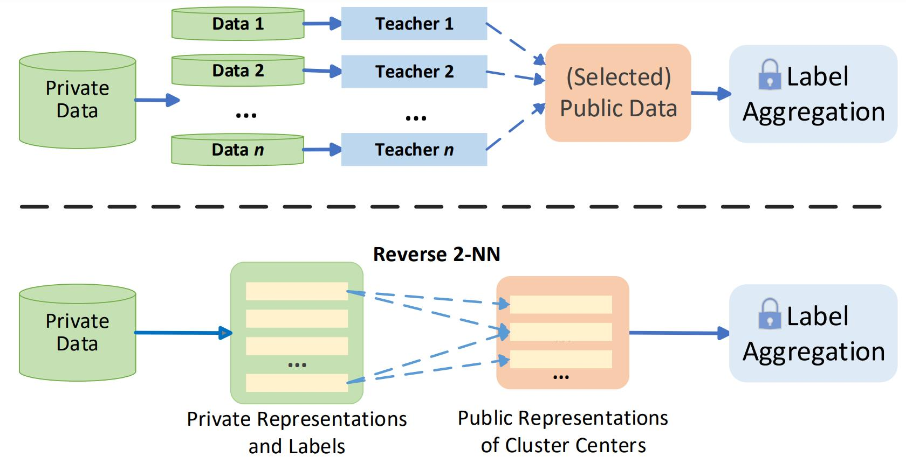

# rknn

This repository contains the implementation code of Fine-grained Private Knowledge Distillation [[arxiv](https://arxiv.org/pdf/2207.13253.pdf)].
Enter subfolders to view the guide for running.

 

Comparison of the current paradigm of federated knowledge distillation (top)
  and our record-level private knowledge distillation with reverse k-NN (bottom).
